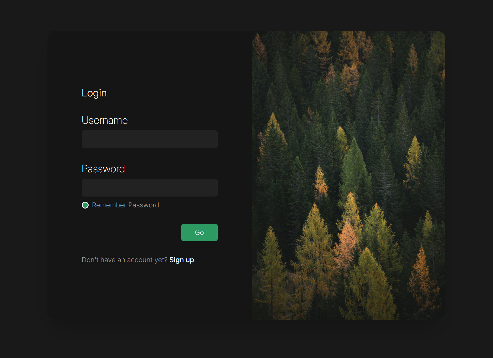

# Responsive Login Page - React + Tailwind CSS

This is a simple login screen built with **React** and **Tailwind CSS**. It features a clean, dark-themed design with custom checkbox styling, smooth hover animations, and responsive layout.

## Features

- Responsive layout
- Dark UI with gradients and image section
- Focus-highlighted input fields
- Fully customized circular checkbox (white border, green fill on check)
- Animated submit button on hover
- Clean and modular code

## Preview



## Technologies

- [React](https://reactjs.org/)
- [Tailwind CSS](https://tailwindcss.com/)

## How to Run

1. Clone the repository:

```bash
git clone https://github.com/MatheusCDias/Responsive-Login-Page.git
